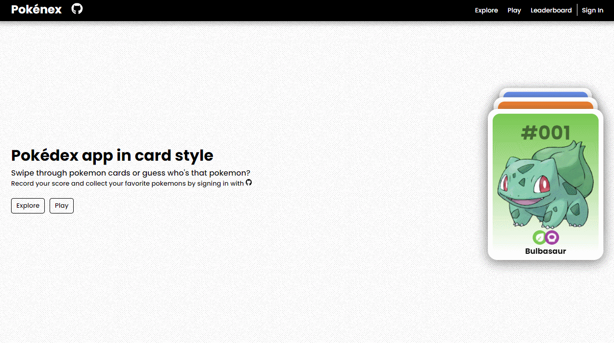

<br />
<p align="center">
    

  <h1 align="center">Pokénex</h1>

  <p align="center">
    Pokédex app in card style. Swipe through pokemon cards or guess who&apos;s that pokemon?.
    <br />
    <a href="https://github.com/kitharvey/pokenex/blob/main/README.md"><strong>Explore the docs »</strong></a>
    <br />
    <br />
    <a href="https://pokenex.vercel.app/" target="_blank" >View Demo</a>
    ·
    <a href="https://github.com/kitharvey/pokenex/issues" target="_blank" >Report Bug</a>
    ·
    <a href="https://github.com/kitharvey/pokenex/issues" target="_blank" >Request Feature</a>
    ·
    <a href="https://github.com/kitharvey/pokenex/blob/main/How_its_made.md" target="_blank" >How it's made?</a>
  </p>
</p>

<!-- TABLE OF CONTENTS -->
<details open="open">
  <summary>Table of Contents</summary>
  <ol>
    <li>
      <a href="#about-the-project">About The Project</a>
      <ul>
        <li><a href="#built-with">Built With</a></li>
      </ul>
    </li>
    <li>
      <a href="#getting-started">Getting Started</a>
      <ul>
        <li><a href="#prerequisites">Prerequisites</a></li>
        <li><a href="#installation">Installation</a></li>
      </ul>
    </li>
    <li><a href="#roadmap">Roadmap</a></li>
    <li><a href="#contact">Contact</a></li>
  </ol>
</details>

<br />
<br />

<!-- ABOUT THE PROJECT -->

## About The Project



There are many great pokédex apps online but I found most of them are similarly built, displayed in a grid, scroll and click a pokémon to view more details about it. So I build my own but in a different style.

No mobile version yet.

Features:

- Swipe pokémon cards to explore
- Add to favorites
- Play "who's that pokémon?"
- Climb the leaderboard

Of course, I will be adding more soon or you can <a href="https://github.com/kitharvey/pokenex/issues" target="_blank" >request a feature</a>.

<br />
<br />

### Built With

- [PokéAPI](https://pokeapi.co/)
- [Nextjs](https://nextjs.org/)
- [TypeScript](https://www.typescriptlang.org/)
- [Sass](https://sass-lang.com/)
- [Framer](https://www.framer.com/api/motion/)
- [next-auth](https://firebase.google.com/docs/auth)
- [MongoDB](https://www.mongodb.com/)
- [Mongoose](https://mongoosejs.com/)
- [Pokémon Assets from HybridShivam](https://github.com/HybridShivam/pokémon)

<br />
<br />

<!-- GETTING STARTED -->

## Getting Started

To get a local copy up and running follow these simple example steps.

### Prerequisites

This is an example of how to list things you need to use the software and how to install them.

- yarn
  ```sh
  npm install --global yarn
  ```

### Installation

1. Clone the repo
   ```sh
   git clone https://github.com/kitharvey/pokenex.git
   ```
2. Go to project directory
   ```sh
   cd pokenex
   ```
3. Install NPM packages
   ```sh
   yarn
   ```
4. Create [MongoDB](https://www.mongodb.com/), set up your database and copy MONGODB_URI
5. Create [Github-OAuth](https://github.com/settings/applications/new) and copy client ID and secrets
6. Create `.env` file and add URI and keys
   ```js
   MONGODB_URI = "xxxxxxxxxxxxxxxxxxxxxxxx"
   GITHUB_CLIENT_ID = "xxxxxxxxxxxxxxxxxxxxxxxx"
   GITHUB_CLIENT_SECRET = "xxxxxxxxxxxxxxxxxxxxxxxx"
   AUTH_SECRET = "xxxxxxxxxxxxxxxxxxxxxxxx"
   JWT_SECRET = "xxxxxxxxxxxxxxxxxxxxxxxx"
   JWT_SIGNING_PRIVATE_KEY = "xxxxxxxxxxxxxxxxxxxxxxxx"
   NEXTAUTH_URL = "http://localhost:3000/"
   ```
7. Start the application in your localhost
   ```sh
   yarn dev
   ```
   <br />
   <br />

## Roadmap

This project is still under development.

<!-- See the [open issues](https://github.com/kitharvey/pokenex/issues) for a list of proposed features (and known issues). -->

<br />
<br />

<!-- CONTACT -->

## Contact

Kit Harvey - [linkedIn](https://www.linkedin.com/in/kitharvey/)

Project Link: [https://github.com/kitharvey/pokenex](https://github.com/kitharvey/pokenex)

<br/>
<br/>
